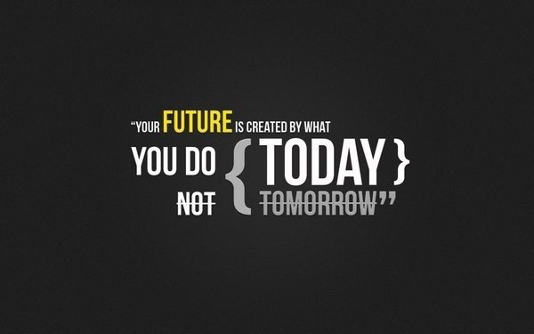

   

# Samwel Mong'are (Sammy) - Full-Stack Developer 💻 🚀

### 👋 About Me
Hey there! I’m **Samwel Mong'are**, but you can call me **Sammy**. I’m a **full-stack developer** from Nairobi who codes like there's no tomorrow! When I’m not building killer apps, you’ll find me binge-watching tech YouTubers, dreaming of space travel 🚀, or crushing it in a game of **Rocket League** 🎮.

**Fun fact**: I once tried to write an app that could predict when I'd finish my projects... still waiting for accurate results 😅.

### 💼 Professional Skills

#### Languages:
  
 
 

#### Frameworks:
 
  
  
 

#### Cloud & DevOps:
  
  
 

#### Databases:
  
 

#### Version Control:
  
 

#### Other Tools:
  
 

### 🚀 Projects
1. **[Football Fan Companion](https://github.com/samwel-mongare/football_fan_companion)** – A go-to app for football fanatics. Whether you love the Premier League or La Liga, I've got you covered.
2. **[Space Travellers](https://github.com/samwel-mongare/space_travellers)** – Ready to book a rocket? No? Well, you can at least dream with this space mission app.
3. **[My Personal Portfolio](https://github.com/samwel-mongare/Personal-Portfolio)** – A glimpse into my world, featuring some of the coolest stuff I’ve built!

### 🎉 Fun Facts About Me:
- When I’m not coding, you can find me **debating who the real G.O.A.T is in football** (Messi? Ronaldo? Let's discuss 🤔).
- I once thought I could write an entire web app in one night... turns out I’m human after all.
- My dream job? **Becoming an astronaut developer**—coding in zero gravity. (NASA, call me! 😎)

### 📫 Reach Me
- **Email**: [mongaresams@gmail.com](mailto:mongaresams@gmail.com)
- Or just DM me on 

 
  
# Github Streak Stats

 

 
