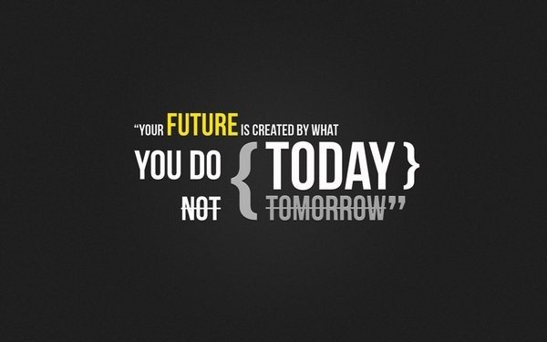

<div align="center">



# ⚡ Samwel Mongare (Sammy)
### Full-Stack Engineer · Product Builder · AI-Powered Developer

[](https://twitter.com/sam_mongare)
[](https://www.linkedin.com/in/samwel-mongare/)
[](https://your-portfolio.com)
[](https://github.com/samwel-mongare)
[](mailto:mongaresams@gmail.com)

</div>

---

## 👋 Who Am I?

I'm a **Full-Stack Software Engineer** based in **Nairobi, Kenya** 🇰🇪 with a rare blend of engineering depth and product instinct. I've gone from **building QA pipelines** → **leading digital transformations** → **architecting entire platforms solo** as the only engineer at an early-stage startup.

I don't just write code — I **build products**. I obsess over architecture decisions, user experience, and shipping things that actually work. Currently, I'm the sole engineer behind a food delivery platform, owning everything from system design to deployment.

> *"I leverage AI tools not as a crutch, but as a force multiplier — shipping faster, debugging smarter, and documenting better."*

---

## 🚀 What I Bring to the Table

| Capability | Details |
|---|---|
| 🏗️ **System Architecture** | Designed and owned full-stack architecture for production platforms |
| 🤖 **AI-Augmented Dev** | Integrate LLM tools into daily coding, debugging & documentation workflows |
| 📦 **3rd-Party Integrations** | Expert at "buy over build" — unifying external services into cohesive platforms |
| 🧪 **Quality Engineering** | 100+ white/black-box tests, 95% bug-free feature deployments |
| 📈 **Product Thinking** | Led feature prioritization, backlog management, and cross-functional delivery |
| 🌍 **Digital Growth** | Built e-commerce ecosystems with Meta Pixel, TikTok Pixel, SEO & analytics |
| 🧑‍🏫 **Mentorship** | Code reviewer and mentor for junior developers across remote teams |

---

## 🛠️ Tech Stack

### 🎨 Front-End


### ⚙️ Back-End


### 🗄️ Databases


### ☁️ Cloud, DevOps & Tools


---

## 💼 Career Highlights

```
🚀 2025–Present   Software Engineer      → Sole engineer at an early-stage food delivery startup
📈 2024–2025      Digital Product Lead   → Led full digital transformation: 0 → e-commerce + social ecosystem
🧪 2024           PM / QA Lead           → 30% faster feature delivery | 95% bug-free deployments
💻 2023–2024      Full Stack Developer   → Real estate AI agent | React dashboards | AWS Lambda + Puppeteer
🌐 2022–Present   Full Stack Consultant  → NextJS SSR | 40% faster load times | WCAG 2.1 accessibility
✅ 2022–Present   Code Reviewer          → 50% improvement in junior dev coding skills | Team standards lead
```

---

## 📊 GitHub Stats

<div align="center">

[](https://github.com/samwel-mongare)


</div>

---

## 🎯 Currently

- 🔨 **Building:** A food delivery platform from scratch as the sole engineer
- 🤖 **Exploring:** AI integration patterns in production workflows
- 🌱 **Learning:** Deeper cloud infrastructure & scalable system design
- 🎤 **Interested in:** Teen career coaching & developer mentorship

---

## 🤝 Let's Connect

I'm always open to interesting conversations, collaborations, or just nerding out about tech.

<div align="center">

[](https://twitter.com/sam_mongare)
[](https://www.linkedin.com/in/samwel-mongare/)
[](mailto:mongaresams@gmail.com)

</div>

---

<div align="center">

*Built with curiosity, caffeine, and way too many open browser tabs ☕*


</div>
